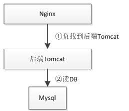
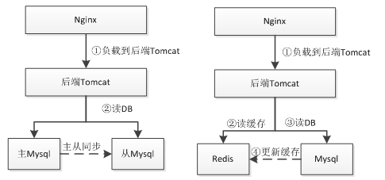
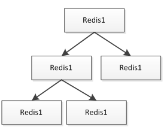
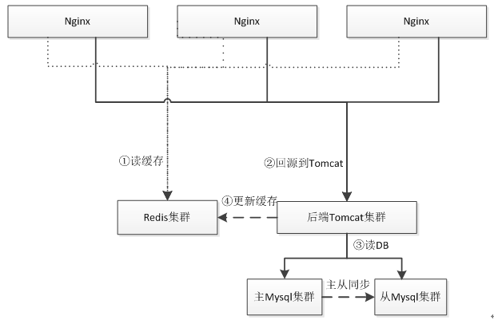
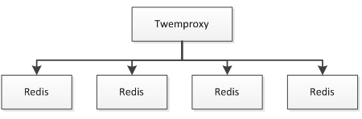
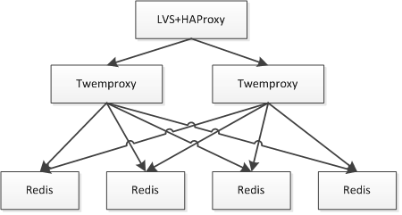
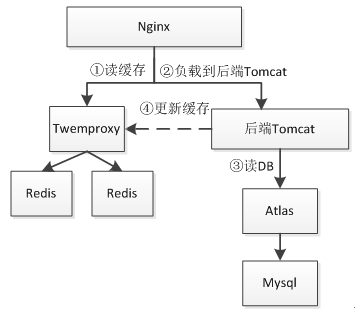
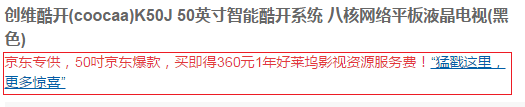

# HTTP 服务  
  
此处我说的 HTTP 服务主要指如访问京东网站时我们看到的热门搜索、用户登录、实时价格、实时库存、服务支持、广告语等这种非 Web 页面，而是在 Web 页面中异步加载的相关数据。这些服务有个特点即访问量巨大、逻辑比较单一；但是如实时库存逻辑其实是非常复杂的。在京东这些服务每天有几亿十几亿的访问量，比如实时库存服务曾经在没有任何 IP 限流、DDos 防御的情况被刷到600多万/分钟的访问量，而且能轻松应对。支撑如此大的访问量就需要考虑设计良好的架构，并很容易实现水平扩展。
 
## 架构  

此处介绍下我曾使用过 Nginx+JavaEE 的架构。
 
### 单 DB 架构
  
  

早期架构可能就是 Nginx 直接 upstream 请求到后端 Tomcat，扩容时基本是增加新的 Tomcat 实例，然后通过 Nginx 负载均衡 upstream 过去。此时数据库还不是瓶颈。当访问量到一定级别，数据库的压力就上来了，此处单纯的靠单个数据库可能扛不住了，此时可以通过数据库的读写分离或加缓存来实现。
 
### DB+Cache/ 数据库读写分离架构
  
   

此时就通过使用如数据库读写分离或者 Redis 这种缓存来支撑更大的访问量。使用缓存这种架构会遇到的问题诸如缓存与数据库数据不同步造成数据不一致（一般设置过期时间），或者如 Redis 挂了，此时会直接命中数据库导致数据库压力过大；可以考虑 Redis 的主从或者一致性Hash 算法做分片的 Redis 集群；使用缓存这种架­构要求应用对数据的一致性要求不是很高；比如像下订单这种要落地的数据不适合用 Redis 存储，但是订单的读取可以使用缓存。
 
### Nginx+Lua+Local Redis+Mysql 集群架构
  
  
 
首先 Nginx 通过 Lua 读取本机 Redis 缓存，如果不命中才回源到后端 Tomcat 集群；后端Tomcat 集群再读取 Mysql 数据库。Redis 都是安装到和 Nginx 同一台服务器，Nginx 直接读本机可以减少网络延时。Redis 通过主从方式同步数据，Redis 主从一般采用树的方式实现：
   
   

在叶子节点可以做 AOF 持久化，保证在主 Redis 挂时能进行恢复；此处假设对 Redis 很依赖的话，可以考虑多主 Redis 架构，而不是单主，来防止单主挂了时数据的不一致和击穿到后端Tomcat 集群。这种架构的缺点就是要求 Redis 实例数据量较小，如果单机内存不足以存储这么多数据，当然也可以通过如尾号为 1 的在 A 服务器，尾号为 2 的在 B 服务器这种方式实现；缺点也很明显，运维复杂、扩展性差。
 
### Nginx+Lua+Redis 集群 +Mysql 集群架构 
  
 

和之前架构不同的点是此时我们使用一致性 Hash 算法实现 Redis 集群而不是读本机 Redis，保证其中一台挂了，只有很少的数据会丢失，防止击穿到数据库。Redis 集群分片可以使用Twemproxy；如果 Tomcat 实例很多的话，此时就要考虑 Redis 和 Mysql 链接数问题，因为大部分 Redis/Mysql 客户端都是通过连接池实现，此时的链接数会成为瓶颈。一般方法是通过中间件来减少链接数。
  
   

Twemproxy 与 Redis 之间通过单链接交互，并 Twemproxy 实现分片逻辑；这样我们可以水平扩展更多的 Twemproxy 来增加链接数。
 
此时的问题就是 Twemproxy 实例众多，应用维护配置困难；此时就需要在之上做负载均衡，比如通过 LVS/HAProxy 实现 VIP（虚拟 IP ），可以做到切换对应用透明、故障自动转移；还可以通过实现内网 DNS 来做其负载均衡。
  
   

本文没有涉及 Nginx 之上是如何架构的，对于 Nginx、Redis、Mysql 等的负载均衡、资源的CDN 化不是本文关注的点，有兴趣可以参考  

[很早的 Taobao CDN 架构 ](http://www.docin.com/p-57729070.html)
  
[Nginx/LVS/HAProxy 负载均衡软件的优缺点详解](http://www.ha97.com/5646.html) 
  
## 实现  

接下来我们来搭建一下第四种架构。
  
  

以获取如京东商品页广告词为例，如下图
  
  

假设京东有10亿商品，那么广告词极限情况是10亿；所以在设计时就要考虑：  

1. 数据量，数据更新是否频繁且更新量是否很大；
2. 是K-V还是关系，是否需要批量获取，是否需要按照规则查询。
 
而对于本例，广告词更新量不会很大，每分钟可能在几万左右；而且是 K-V 的，其实适合使用关系存储；因为广告词是商家维护，因此后台查询需要知道这些商品是哪个商家的；而对于前台是不关心商家的，是 KV 存储，所以前台显示的可以放进如 Redis 中。 即存在两种设计：  

1. 所有数据存储到 Mysql，然后热点数据加载到 Redis；
2. 关系存储到 Mysql，而数据存储到如SSDB这种持久化KV存储中。
 
基本数据结构：商品 ID、广告词、所属商家、开始时间、结束时间、是否有效。
 
## 后台逻辑  

1. 商家登录后台；
2. 按照商家分页查询商家数据，此处要按照商品关键词或商品类目查询的话，需要走商品系统的搜索子系统，如通过 Solr或elasticsearch 实现搜索子系统；
3. 进行广告词的增删改查；
4. 增删改时可以直接更新 Redis 缓存或者只删除 Redis 缓存（第一次前台查询时写入缓存）；
 
## 前台逻辑   

1. 首先 Nginx 通过 Lua 查询 Redis 缓存；
2. 查询不到的话回源到 Tomcat，Tomcat 读取数据库查询到数据，然后把最新的数据异步写入Redis（一般设置过期时间，如5分钟）；此处设计时要考虑假设 Tomcat 读取 Mysql 的极限值是多少，然后设计降级开关，如假设每秒回源达到 100，则直接不查询 Mysql 而返回空的广告词来防止 Tomcat 应用雪崩。
 
为了简单，我们不进行后台的设计实现，只做前端的设计实现，此时数据结构我们简化为[商品ID、广告词]。另外有朋友可能看到了，可以直接把 Tomcat 部分干掉，通过 Lua 直接读取Mysql 进行回源实现。为了完整性此处我们还是做回源到 Tomcat 的设计，因为如果逻辑比较复杂的话或一些限制（比如使用 Java 特有协议的 RPC）还是通过 Java 去实现更方便一些。
 
## 项目搭建  

项目部署目录结构。  

Java **代码**  
  
```
/usr/chapter6  
  redis_6660.conf  
  redis_6661.conf  
  nginx_chapter6.conf  
  nutcracker.yml  
  nutcracker.init  
  webapp  
WEB-INF  
   lib  
   classes  
   web.xml   
```  

## Redis+Twemproxy 配置  

此处根据实际情况来决定 Redis 大小，此处我们已两个 Redis 实例（6660、6661），在Twemproxy 上通过一致性 Hash 做分片逻辑。
 
### 安装  

之前已经介绍过 Redis 和 Twemproxy 的安装了。
 
**Redis配置redis_6660.conf和redis_6661.conf **   
  
Java **代码**    
  
```
\#分别为6660 6661  
port 6660  
\#进程ID 分别改为redis_6660.pid redis_6661.pid  
pidfile "/var/run/redis_6660.pid"  
\#设置内存大小，根据实际情况设置，此处测试仅设置20mb  
maxmemory 20mb  
\#内存不足时，按照过期时间进行LRU删除  
maxmemory-policy volatile-lru  
\#Redis的过期算法不是精确的而是通过采样来算的，默认采样为3个，此处我们改成10  
maxmemory-samples 10  
\#不进行RDB持久化  
save “”  
\#不进行AOF持久化  
appendonly no   
```  
 
将如上配置放到 redis\_6660.conf 和 redis\_6661.conf 配置文件最后即可，后边的配置会覆盖前边的。  
 
**Twemproxy配置nutcracker.yml**   

Java **代码**    
  
```
server1:  
  listen: 127.0.0.1:1111  
  hash: fnv1a_64  
  distribution: ketama  
  redis: true  
  timeout: 1000  
  servers:  
   - 127.0.0.1:6660:1 server1  
   - 127.0.0.1:6661:1 server2   
```  
 
 复制 nutcracker.init 到 /usr/chapter6 下，并修改配置文件为 /usr/chapter6/nutcracker.yml。
  
 
### 启动  

Java **代码**   
  
```
nohup /usr/servers/redis-2.8.19/src/redis-server  /usr/chapter6/redis_6660.conf &  
nohup /usr/servers/redis-2.8.19/src/redis-server  /usr/chapter6/redis_6661.conf &  
/usr/chapter6/nutcracker.init start  
ps -aux | grep -e redis  -e nutcracker  
```  
 
## Mysql+Atlas 配置  
 
Atlas 类似于 Twemproxy，是 Qihoo 360 基于 Mysql Proxy 开发的一个 Mysql 中间件，据称每天承载读写请求数达几十亿，可以实现分表、读写分离、数据库连接池等功能，缺点是没有实现跨库分表（分库）功能，需要在客户端使用分库逻辑。另一个选择是使用如阿里的 TDDL，它是在客户端完成之前说的功能。到底选择是在客户端还是在中间件根据实际情况选择。
 
此处我们不做 Mysql 的主从复制（读写分离），只做分库分表实现。
 
### Mysql 初始化
 
为了测试我们此处分两个表。
 
Java **代码** 
  
``` 
CREATE DATABASE chapter6 DEFAULT CHARACTER SET utf8;  
use chapter6;  
CREATE TABLE  chapter6.ad_0(  
      sku_id BIGINT,  
      content VARCHAR(4000)  
) ENGINE=InnoDB  DEFAULT CHARSET=utf8;  
CREATE TABLE  chapter6.ad_1  
      sku_id BIGINT,  
      content VARCHAR(4000)  
) ENGINE=InnoDB  DEFAULT CHARSET=utf8;  
```  
 
### Atlas 安装  

Java **代码**   
  
```
cd /usr/servers/  
wget https://github.com/Qihoo360/Atlas/archive/2.2.1.tar.gz -O Atlas-2.2.1.tar.gz  
tar -xvf Atlas-2.2.1.tar.gz  
cd Atlas-2.2.1/  
\#Atlas依赖mysql_config，如果没有可以通过如下方式安装  
apt-get install libmysqlclient-dev  
\#安装Lua依赖  
wget http://www.lua.org/ftp/lua-5.1.5.tar.gz  
tar -xvf lua-5.1.5.tar.gz  
cd lua-5.1.5/  
make linux && make install  
\#安装glib依赖  
apt-get install libglib2.0-dev  
\#安装libevent依赖  
apt-get install libevent    
\#安装flex依赖  
apt-get install flex  
\#安装jemalloc依赖  
apt-get install libjemalloc-dev  
\#安装OpenSSL依赖  
apt-get install openssl  
apt-get install libssl-dev  
 apt-get install libssl0.9.8  
  
./configure --with-mysql=/usr/bin/mysql_config  
./bootstrap.sh  
make && make install  
```  
 
### Atlas 配置  
 
Java 代码  
  
```
vim /usr/local/mysql-proxy/conf/chapter6.cnf  
Java代码  收藏代码
[mysql-proxy]  
\#Atlas代理的主库，多个之间逗号分隔  
proxy-backend-addresses = 127.0.0.1:3306  
\#Atlas代理的从库，多个之间逗号分隔，格式ip:port@weight，权重默认1  
\#proxy-read-only-backend-addresses = 127.0.0.1:3306,127.0.0.1:3306  
\#用户名/密码，密码使用/usr/servers/Atlas-2.2.1/script/encrypt 123456加密  
pwds = root:/iZxz+0GRoA=  
\#后端进程运行  
daemon = true  
\#开启monitor进程，当worker进程挂了自动重启  
keepalive = true  
\#工作线程数，对Atlas的性能有很大影响，可根据情况适当设置  
event-threads = 64  
\#日志级别  
log-level = message  
\#日志存放的路径  
log-path = /usr/chapter6/  
\#实例名称，用于同一台机器上多个Atlas实例间的区分  
instance = test  
\#监听的ip和port  
proxy-address = 0.0.0.0:1112  
\#监听的管理接口的ip和port  
admin-address = 0.0.0.0:1113  
\#管理接口的用户名  
admin-username = admin  
\#管理接口的密码  
admin-password = 123456  
\#分表逻辑  
tables = chapter6.ad.sku_id.2  
\#默认字符集  
charset = utf8     
```  

因为本例没有做读写分离，所以读库 proxy-read-only-backend-addresses 没有配置。分表逻辑即：数据库名.表名.分表键.表的个数，分表的表名格式是 table\_N，N 从 0 开始。
 
### Atlas 启动/重启/停止  

Java **代码**   
  
```
/usr/local/mysql-proxy/bin/mysql-proxyd chapter6 start  
/usr/local/mysql-proxy/bin/mysql-proxyd chapter6 restart  
/usr/local/mysql-proxy/bin/mysql-proxyd chapter6 stop     
```  

如上命令会自动到 /usr/local/mysql-proxy/conf 目录下查找 chapter6.cnf 配置文件。 
 
### Atlas 管理  

通过如下命令进入管理接口  

Java **代码**   
  
```
mysql -h127.0.0.1 -P1113  -uadmin -p123456  
```  
   
通过执行 SELECT * FROM help 查看帮助。还可以通过一些 SQL 进行服务器的动态添加/移除。
 
### Atlas 客户端  

通过如下命令进入客户端接口
 
Java **代码**   
  
``` 
mysql -h127.0.0.1 -P1112  -uroot -p123456    
```  

Java **代码**   
  
```
use chapter6;  
insert into ad values(1 '测试1);      
insert into ad values(2, '测试2');      
insert into ad values(3 '测试3);      
select * from ad where sku_id=1;  
select * from ad where sku_id=2;  
#通过如下sql可以看到实际的分表结果  
select * from ad_0;  
select * from ad_1;   
```  

此时无法执行 select * from ad，需要使用如 “select * from ad where sku_id=1” 这种 SQL 进行查询；即需要带上 sku\_id 且必须是相等比较；如果是范围或模糊是不可以的；如果想全部查询，只能挨着遍历所有表进行查询。即在客户端做查询-聚合。
 
此处实际的分表逻辑是按照商家进行分表，而不是按照商品编号，因为我们后台查询时是按照商家维度的，此处是为了测试才使用商品编号的。
 
到此基本的 Atlas 就介绍完了，更多内容请参考如下资料：
Mysql 主从复制
[http://369369.blog.51cto.com/319630/790921/](http://369369.blog.51cto.com/319630/790921/)
Mysql中间件介绍
[http://www.guokr.com/blog/475765/](http://www.guokr.com/blog/475765/)
Atlas使用
[http://www.0550go.com/database/mysql/mysql-atlas.html](http://www.0550go.com/database/mysql/mysql-atlas.html)
Atlas文档
[https://github.com/Qihoo360/Atlas/blob/master/README_ZH.md](https://github.com/Qihoo360/Atlas/blob/master/README_ZH.md)
 
## Java+Tomcat 安装  

Java 安装  
   
Java 代码   
  
```
cd /usr/servers/  
\#首先到如下网站下载JDK  
\#http://www.oracle.com/technetwork/cn/java/javase/downloads/jdk7-downloads-1880260.html  
\#本文下载的是 jdk-7u75-linux-x64.tar.gz。  
tar -xvf jdk-7u75-linux-x64.tar.gz  
vim ~/.bashrc  
在文件最后添加如下环境变量  
export JAVA_HOME=/usr/servers/jdk1.7.0_75/  
export PATH=$JAVA_HOME/bin:$JAVA_HOME/jre/bin:$PATH  
export CLASSPATH=$CLASSPATH:.:$JAVA_HOME/lib:$JAVA_HOME/jre/lib  
  
\#使环境变量生效  
source ~/.bashrc  
```  
  
### Tomcat 安装  
 
Java **代码**   
  
``` 
cd /usr/servers/  
wget http://ftp.cuhk.edu.hk/pub/packages/apache.org/tomcat/tomcat-7/v7.0.59/bin/apache-tomcat-7.0.59.tar.gz  
tar -xvf apache-tomcat-7.0.59.tar.gz  
cd apache-tomcat-7.0.59/  
\#启动   
/usr/servers/apache-tomcat-7.0.59/bin/startup.sh   
\#停止  
/usr/servers/apache-tomcat-7.0.59/bin/shutdown.sh  
\#删除tomcat默认的webapp  
rm -r apache-tomcat-7.0.59/webapps/*  
\#通过Catalina目录发布web应用  
cd apache-tomcat-7.0.59/conf/Catalina/localhost/  
vim ROOT.xml   
```  
 
ROOT.xml   

Java **代码**   
  
```
<!-- 访问路径是根，web应用所属目录为/usr/chapter6/webapp -->  
<Context path="" docBase="/usr/chapter6/webapp"></Context>    
```  

Java **代码 **  
  
```
\#创建一个静态文件随便添加点内容  
vim /usr/chapter6/webapp/index.html  
\#启动  
/usr/servers/apache-tomcat-7.0.59/bin/startup.sh    
```  
 
访问如 http://192.168.1.2:8080/index.html 能处理内容说明配置成功。
 
Java **代码 **  
    
``` 
\#变更目录结构  
cd /usr/servers/  
mv apache-tomcat-7.0.59 tomcat-server1  
\#此处我们创建两个tomcat实例  
cp –r tomcat-server1 tomcat-server2  
vim tomcat-server2/conf/server.xml     
```  
   
Java **代码 **  
    
```
\#如下端口进行变更  
8080--->8090  
8005--->8006  
```  
    
启动两个 Tomcat  

Java **代码 **  
    
```
/usr/servers/tomcat-server1/bin/startup.sh   
/usr/servers/tomcat-server2/bin/startup.sh  
```  
   
分别访问，如果能正常访问说明配置正常。
 
[http://192.168.1.2:8080/index.html](http://192.168.1.2:8080/index.html)
[http://192.168.1.2:8090/index.html](http://192.168.1.2:8090/index.html)
 
如上步骤使我们在一个服务器上能启动两个 tomcat 实例，这样的好处是我们可以做本机的Tomcat 负载均衡，假设一个 tomcat 重启时另一个是可以工作的，从而不至于不给用户返回响应。
 
## Java+Tomcat 逻辑开发  

### 搭建项目  

我们使用 Maven 搭建 Web 项目，Maven 知识请自行学习。
 
### 项目依赖  

本文将最小化依赖，即仅依赖我们需要的 servlet、mysql、druid、jedis。  
 
Java **代码**  
  
```
<dependencies>  
  <dependency>  
    <groupId>javax.servlet</groupId>  
    <artifactId>javax.servlet-api</artifactId>  
    <version>3.0.1</version>  
    <scope>provided</scope>  
  </dependency>  
  <dependency>  
    <groupId>mysql</groupId>  
    <artifactId>mysql-connector-java</artifactId>  
    <version>5.1.27</version>  
  </dependency>  
  <dependency>  
    <groupId>com.alibaba</groupId>  
    <artifactId>druid</artifactId>  
    <version>1.0.5</version>  
  </dependency>  
  <dependency>  
    <groupId>redis.clients</groupId>  
    <artifactId>jedis</artifactId>  
    <version>2.5.2</version>  
  </dependency>  
</dependencies>  
```  
 
### 核心代码  

com.github.zhangkaitao.chapter6.servlet.AdServlet  

Java **代码**  
  
```
public class AdServlet extends HttpServlet {  
    @Override  
    protected void doGet(HttpServletRequest req, HttpServletResponse resp) throws ServletException, IOException {  
        String idStr = req.getParameter("id");  
        Long id = Long.valueOf(idStr);  
        //1、读取Mysql获取数据  
        String content = null;  
        try {  
            content = queryDB(id);  
        } catch (Exception e) {  
            e.printStackTrace();  
            resp.setStatus(HttpServletResponse.SC_INTERNAL_SERVER_ERROR);  
            return;  
        }  
        if(content != null) {  
            //2.1、如果获取到，异步写Redis  
            asyncSetToRedis(idStr, content);  
            //2.2、如果获取到，把响应内容返回  
            resp.setCharacterEncoding("UTF-8");  
            resp.getWriter().write(content);  
        } else {  
            //2.3、如果获取不到，返回404状态码  
            resp.setStatus(HttpServletResponse.SC_NOT_FOUND);  
        }  
    }  
  
    private DruidDataSource datasource = null;  
    private JedisPool jedisPool = null;  
  
    {  
        datasource = new DruidDataSource();  
        datasource.setUrl("jdbc:mysql://127.0.0.1:1112/chapter6?useUnicode=true&characterEncoding=utf-8&autoReconnect=true");  
        datasource.setUsername("root");  
        datasource.setPassword("123456");  
        datasource.setMaxActive(100);  
  
        GenericObjectPoolConfig poolConfig = new GenericObjectPoolConfig();  
        poolConfig.setMaxTotal(100);  
        jedisPool = new JedisPool(poolConfig, "127.0.0.1", 1111);  
    }  
  
    private String queryDB(Long id) throws Exception {  
        Connection conn = null;  
        try {  
            conn = datasource.getConnection();  
            String sql = "select content from ad where sku_id = ?";  
            PreparedStatement psst = conn.prepareStatement(sql);  
            psst.setLong(1, id);  
            ResultSet rs = psst.executeQuery();  
            String content = null;  
            if(rs.next()) {  
                content = rs.getString("content");  
            }  
            rs.close();  
            psst.close();  
            return content;  
        } catch (Exception e) {  
            throw e;  
        } finally {  
            if(conn != null) {  
                conn.close();  
            }  
        }  
    }  
  
    private ExecutorService executorService = Executors.newFixedThreadPool(10);  
    private void asyncSetToRedis(final String id, final String content) {  
        executorService.submit(new Runnable() {  
            @Override  
            public void run() {  
                Jedis jedis = null;  
                try {  
                    jedis = jedisPool.getResource();  
                    jedis.setex(id, 5 * 60, content);//5分钟  
                } catch (Exception e) {  
                    e.printStackTrace();  
                    jedisPool.returnBrokenResource(jedis);  
                } finally {  
                    jedisPool.returnResource(jedis);  
                }  
  
            }  
        });  
    }  
}    
```   

整个逻辑比较简单，此处更新缓存一般使用异步方式去更新，这样不会阻塞主线程；另外此处可以考虑走 Servlet 异步化来提示吞吐量。  
 
web.xml 配置  

Java **代码**  
  
```
<servlet>  
    <servlet-name>adServlet</servlet-name>  
    <servlet-class>com.github.zhangkaitao.chapter6.servlet.AdServlet</servlet-class>  
</servlet>  
<servlet-mapping>  
    <servlet-name>adServlet</servlet-name>  
    <url-pattern>/ad</url-pattern>  
</servlet-mapping>  
```  
 
打 WAR 包  
 
Java **代码**  
  
```
cd D:\workspace\chapter6  
mvn clean package  
此处使用maven命令打包，比如本例将得到chapter6.war，然后将其上传到服务器的/usr/chapter6/webapp，然后通过unzip chapter6.war解压。
```  
 
### 测试  
 
启动 Tomcat 实例，分别访问如下地址将看到广告内容：  

Java **代码**  
  
```
http://192.168.1.2:8080/ad?id=1  
http://192.168.1.2:8090/ad?id=1  
```  
 
### nginx 配置  

vim /usr/chapter6/nginx\_chapter6.conf   

Java **代码**  
  
```
upstream backend {  
    server 127.0.0.1:8080 max_fails=5 fail_timeout=10s weight=1 backup=false;  
    server 127.0.0.1:8090 max_fails=5 fail_timeout=10s weight=1 backup=false;  
    check interval=3000 rise=1 fall=2 timeout=5000 type=tcp default_down=false;  
    keepalive 100;  
}  
server {  
    listen       80;  
    server_name  _;  
  
    location ~ /backend/(.*) {  
        keepalive_timeout   30s;  
        keepalive_requests  100;  
  
        rewrite /backend(/.*) $1 break;  
        #之后该服务将只有内部使用，ngx.location.capture  
        proxy_pass_request_headers off;  
        #more_clear_input_headers Accept-Encoding;  
        proxy_next_upstream error timeout;  
        proxy_pass http://backend;  
    }  
}   
```  
 
upstream 配置：[http://nginx.org/cn/docs/http/ngx_http_upstream_module.html](http://nginx.org/cn/docs/http/ngx_http_upstream_module.html)。  
  server：指定上游到的服务器， weight：权重，权重可以认为负载均衡的比例；  fail\_timeout+max\_fails：在指定时间内失败多少次认为服务器不可用，通过proxy\_next\_upstream来判断是否失败。  
  check：ngx\_http\_upstream\_check\_module模块，上游服务器的健康检查，interval：发送心跳包的时间间隔，rise：连续成功rise次数则认为服务器up，fall：连续失败fall次则认为服务器down，timeout：上游服务器请求超时时间，type：心跳检测类型（比如此处使用 tcp ）更多配置请参考 [https://github.com/yaoweibin/  nginx_upstream_check_module](https://github.com/yaoweibin/  nginx_upstream_check_module) 和 [http://tengine.taobao.org/document_cn/http_upstream_check_cn.html](http://tengine.taobao.org/document_cn/http_upstream_check_cn.html)。    
  keepalive：用来支持 upstream server http keepalive 特性(需要上游服务器支持，比如 tomcat )。默认的负载均衡算法是 round-robin，还可以根据 ip、url 等做 hash 来做负载均衡。更多资料请参考官方文档。
 
tomcat keepalive 配置： [http://tomcat.apache.org/tomcat-7.0-doc/config/http.html](http://tomcat.apache.org/tomcat-7.0-doc/config/http.html)。
  maxKeepAliveRequests：默认100；
  keepAliveTimeout：默认等于 connectionTimeout，默认 60 秒；
 
location proxy 配置：[http://nginx.org/cn/docs/http/ngx_http_proxy_module.html](http://nginx.org/cn/docs/http/ngx_http_proxy_module.html)。
  rewrite：将当前请求的 url 重写，如我们请求时是 /backend/ad，则重写后是 /ad。
  proxy\_pass：将整个请求转发到上游服务器。
  proxy\_next\_upstream：什么情况认为当前 upstream server 失败，需要 next upstream，默认是连接失败/超时，负载均衡参数。
  proxy\_pass\_request\_headers：之前已经介绍过了，两个原因：1、假设上游服务器不需要请求头则没必要传输请求头；2、ngx.location.capture时防止 gzip 乱码（也可以使用more\_clear\_input_headers 配置）。
  keepalive：keepalive\_timeout：keepalive 超时设置，keepalive\_requests：长连接数量。此处的 keepalive（别人访问该 location 时的长连接）和 upstream keepalive（nginx 与上游服务器的长连接）是不一样的；此处注意，如果您的服务是面向客户的，而且是单个动态内容就没必要使用长连接了。
 
vim /usr/servers/nginx/conf/nginx.conf  

Java **代码**  
  
```
include /usr/chapter6/nginx_chapter6.conf;  
\#为了方便测试，注释掉example.conf  
\#include /usr/example/example.conf;  
```  

重启 nginx   

/usr/servers/nginx/sbin/nginx -s reload      
 
访问如 192.168.1.2/backend/ad?id=1 即看到结果。可以 kill 掉一个 tomcat，可以看到服务还是正常的。
 
vim /usr/chapter6/nginx\_chapter6.conf   

Java **代码**  
  
```
location ~ /backend/(.*) {  
    internal;  
    keepalive_timeout   30s;  
    keepalive_requests  1000;  
    #支持keep-alive  
    proxy_http_version 1.1;  
    proxy_set_header Connection "";  
  
    rewrite /backend(/.*) $1 break;  
    proxy_pass_request_headers off;  
    #more_clear_input_headers Accept-Encoding;  
    proxy_next_upstream error timeout;  
    proxy_pass http://backend;  
}   
```  
 
加上 internal，表示只有内部使用该服务。 
 
## Nginx+Lua 逻辑开发  

核心代码  
 
/usr/chapter6/ad.lua  
 
Java **代码**  
  
```
local redis = require("resty.redis")  
local cjson = require("cjson")  
local cjson_encode = cjson.encode  
local ngx_log = ngx.log  
local ngx_ERR = ngx.ERR  
local ngx_exit = ngx.exit  
local ngx_print = ngx.print  
local ngx_re_match = ngx.re.match  
local ngx_var = ngx.var  
  
local function close_redis(red)  
    if not red then  
        return  
    end  
    --释放连接(连接池实现)  
    local pool_max_idle_time = 10000 --毫秒  
    local pool_size = 100 --连接池大小  
    local ok, err = red:set_keepalive(pool_max_idle_time, pool_size)  
  
    if not ok then  
        ngx_log(ngx_ERR, "set redis keepalive error : ", err)  
    end  
end  
local function read_redis(id)  
    local red = redis:new()  
    red:set_timeout(1000)  
    local ip = "127.0.0.1"  
    local port = 1111  
    local ok, err = red:connect(ip, port)  
    if not ok then  
        ngx_log(ngx_ERR, "connect to redis error : ", err)  
        return close_redis(red)  
    end  
  
    local resp, err = red:get(id)  
    if not resp then  
        ngx_log(ngx_ERR, "get redis content error : ", err)  
        return close_redis(red)  
    end  
        --得到的数据为空处理  
    if resp == ngx.null then  
        resp = nil  
    end  
    close_redis(red)  
  
    return resp  
end  
  
local function read_http(id)  
    local resp = ngx.location.capture("/backend/ad", {  
        method = ngx.HTTP_GET,  
        args = {id = id}  
    })  
  
    if not resp then  
        ngx_log(ngx_ERR, "request error :", err)  
        return  
    end  
  
    if resp.status ~= 200 then  
        ngx_log(ngx_ERR, "request error, status :", resp.status)  
        return  
    end  
  
    return resp.body  
end  
  
  
--获取id  
local id = ngx_var.id  
  
--从redis获取  
local content = read_redis(id)  
  
--如果redis没有，回源到tomcat  
if not content then  
   ngx_log(ngx_ERR, "redis not found content, back to http, id : ", id)  
    content = read_http(id)  
end  
  
--如果还没有返回404  
if not content then  
   ngx_log(ngx_ERR, "http not found content, id : ", id)  
   return ngx_exit(404)  
end  
  
--输出内容  
ngx.print("show_ad(")  
ngx_print(cjson_encode({content = content}))  
ngx.print(")")   
```  
 
将可能经常用的变量做成局部变量，如 local ngx\_print = ngx.print；使用 jsonp 方式输出，此处我们可以将请求 url 限定为 /ad/id 方式，这样的好处是1、可以尽可能早的识别无效请求；2、可以走 nginx 缓存 /CDN 缓存，缓存的 key 就是 URL，而不带任何参数，防止那些通过加随机数穿透缓存；3、jsonp 使用固定的回调函数 show\_ad()，或者限定几个固定的回调来减少缓存的版本。
 
vim /usr/chapter6/nginx\_chapter6.conf  
 
Java **代码**  
  
```
location ~ ^/ad/(\d+)$ {  
    default_type 'text/html';  
    charset utf-8;  
    lua_code_cache on;  
    set $id $1;  
    content_by_lua_file /usr/chapter6/ad.lua;  
}  
```  
 
重启 nginx  

Java **代码**  
  
```
/usr/servers/nginx/sbin/nginx -s reload  
```  

访问如 http://192.168.1.2/ad/1 即可得到结果。而且注意观察日志，第一次访问时不命中Redis，回源到 Tomcat；第二次请求时就会命中 Redis 了。
 
第一次访问时将看到 /usr/servers/nginx/logs/error.log 输出类似如下的内容，而第二次请求相同的 url 不再有如下内容：  

Java **代码**  
  
```
redis not found content, back to http, id : 2  
``` 
 
到此整个架构就介绍完了，此处可以直接不使用 Tomcat，而是 Lua 直连 Mysql 做回源处理；另外本文只是介绍了大体架构，还有更多业务及运维上的细节需要在实际应用中根据自己的场景自己摸索。后续如使用 LVS/HAProxy 做负载均衡、使用 CDN 等可以查找资料学习。