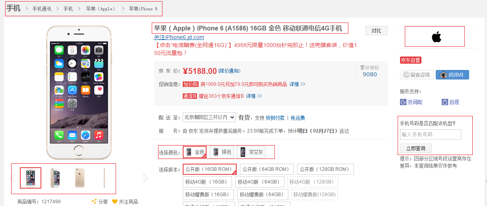
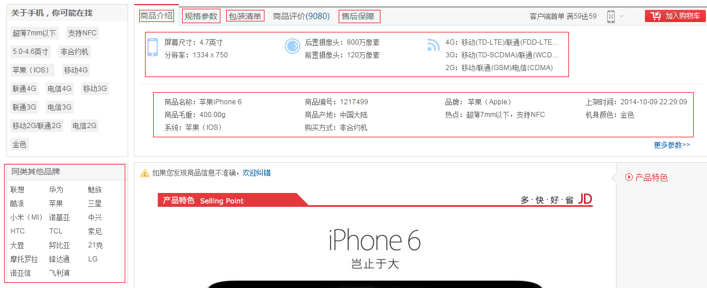
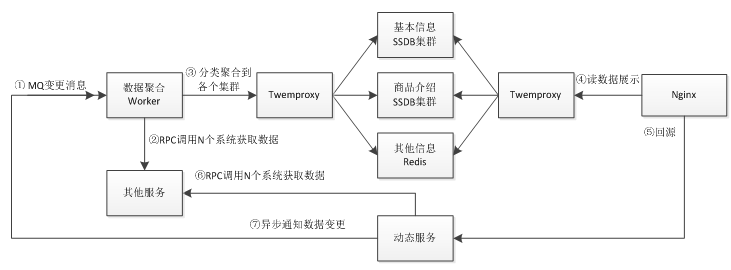
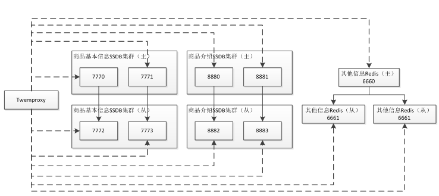

# Web 开发实战2——商品详情页  
  
本章以京东商品详情页为例，京东商品详情页虽然仅是单个页面，但是其数据聚合源是非常多的，除了一些实时性要求比较高的如价格、库存、服务支持等通过 AJAX 异步加载加载之外，其他的数据都是在后端做数据聚合然后拼装网页模板的。
[http://item.jd.com/1217499.html](http://item.jd.com/1217499.html)

  


如图所示，商品页主要包括商品基本信息（基本信息、图片列表、颜色/尺码关系、扩展属性、规格参数、包装清单、售后保障等）、商品介绍、其他信息（分类、品牌、店铺【第三方卖家】、店内分类【第三方卖家】、同类相关品牌）。更多细节此处就不阐述了。
 
整个京东有数亿商品，如果每次动态获取如上内容进行模板拼装，数据来源之多足以造成性能无法满足要求；最初的解决方案是生成静态页，但是静态页的最大的问题：1、无法迅速响应页面需求变更；2、很难做多版本线上对比测试。如上两个因素足以制约商品页的多样化发展，因此静态化技术不是很好的方案。
 
通过分析，数据主要分为四种：商品页基本信息、商品介绍（异步加载）、其他信息（分类、品牌、店铺等）、其他需要实时展示的数据（价格、库存等）。而其他信息如分类、品牌、店铺是非常少的，完全可以放到一个占用内存很小的 Redis 中存储；而商品基本信息我们可以借鉴静态化技术将数据做聚合存储，这样的好处是数据是原子的，而模板是随时可变的，吸收了静态页聚合的优点，弥补了静态页的多版本缺点；另外一个非常严重的问题就是严重依赖这些相关系统，如果它们挂了或响应慢则商品页就挂了或响应慢；商品介绍我们也通过 AJAX 技术惰性加载（因为是第二屏，只有当用户滚动鼠标到该屏时才显示）；而实时展示数据通过 AJAX 技术做异步加载；因此我们可以做如下设计：
1. 接收商品变更消息，做商品基本信息的聚合，即从多个数据源获取商品相关信息如图片列表、颜色尺码、规格参数、扩展属性等等，聚合为一个大的 JSON 数据做成数据闭环，以 key-value存储；因为是闭环，即使依赖的系统挂了我们商品页还是能继续服务的，对商品页不会造成任何影响；
2. 接收商品介绍变更消息，存储商品介绍信息；
3. 介绍其他信息变更消息，存储其他信息。
 
整个架构如下图所示： 
  
  

## 技术选型  

MQ 可以使用如 [Apache ActiveMQ](http://activemq.apache.org/)；
Worker/ 动态服务可以通过如 Java 技术实现；
RPC 可以选择如 [alibaba Dubbo](https://github.com/alibaba/dubbo)；
KV 持久化存储可以选择 [SSDB](https://github.com/ideawu/ssdb)（如果使用 SSD 盘则可以选择[ SSDB+RocksDB 引擎](https://github.com/ideawu/ssdb-rocks)）或者 [ARDB](https://github.com/yinqiwen/ardb)（ LMDB 引擎版）；
缓存使用 Redis；
SSDB/Redis 分片使用如 Twemproxy，这样不管使用 Java 还是 Nginx+Lua，它们都不关心分片逻辑；
前端模板拼装使用 Nginx+Lua；
数据集群数据存储的机器可以采用 RAID 技术或者主从模式防止单点故障；
因为数据变更不频繁，可以考虑 SSD 替代机械硬盘。
 
## 核心流程  

1. 首先我们监听商品数据变更消息；
2. 接收到消息后，数据聚合 Worker 通过 RPC 调用相关系统获取所有要展示的数据，此处获取数据的来源可能非常多而且响应速度完全受制于这些系统，可能耗时几百毫秒甚至上秒的时间；
3. 将数据聚合为 JSON 串存储到相关数据集群；
4. 前端 Nginx 通过 Lua 获取相关集群的数据进行展示；商品页需要获取基本信息+其他信息进行模板拼装，即拼装模板仅需要两次调用（另外因为其他信息数据量少且对一致性要求不高，因此我们完全可以缓存到 Nginx 本地全局内存，这样可以减少远程调用提高性能）；当页面滚动到商品介绍页面时异步调用商品介绍服务获取数据；
5. 如果从聚合的 SSDB 集群 /Redis 中获取不到相关数据；则回源到动态服务通过 RPC 调用相关系统获取所有要展示的数据返回（此处可以做限流处理，因为如果大量请求过来的话可能导致服务雪崩，需要采取保护措施），此处的逻辑和数据聚合 Worker 完全一样；然后发送 MQ 通知数据变更，这样下次访问时就可以从聚合的 SSDB 集群 /Redis 中获取数据了。
 
基本流程如上所述，主要分为 Worker、动态服务、数据存储和前端展示；因为系统非常复杂，只介绍动态服务和前端展示、数据存储架构；Worker 部分不做实现。
  
## 项目搭建  

项目部署目录结构。
/usr/chapter7
  ssdb_basic_7770.conf
  ssdb_basic_7771.conf
  ssdb_basic_7772.conf
  ssdb_basic_7773.conf
  ssdb_desc_8880.conf
  ssdb_desc_8881.conf
  ssdb_desc_8882.conf
  ssdb_desc_8883.conf
  redis_other_6660.conf
  redis_other_6661.conf
  nginx_chapter7.conf
  nutcracker.yml
  nutcracker.init
  item.html
  header.html
  footer.html
  item.lua
  desc.lua
  lualib
    item.lua
    item
      common.lua
  webapp
WEB-INF
   lib
   classes
   web.xml
 
## 数据存储实现

  
  
整体架构为主从模式，写数据到主集群，读数据从从集群读取数据，这样当一个集群不足以支撑流量时可以使用更多的集群来支撑更多的访问量；集群分片使用 Twemproxy 实现。
 
### 商品基本信息 SSDB 集群配置  

vim /usr/chapter7/ssdb\_basic\_7770.conf  \

Java **代码**  
  
```
work_dir = /usr/data/ssdb_7770  
pidfile = /usr/data/ssdb_7770.pid  
  
server:  
        ip: 0.0.0.0  
        port: 7770  
        allow: 127.0.0.1  
        allow: 192.168  
  
replication:  
        binlog: yes  
        sync_speed: -1  
        slaveof:  
logger:  
        level: error  
        output: /usr/data/ssdb_7770.log  
        rotate:  
                size: 1000000000  
  
leveldb:  
        cache_size: 500  
        block_size: 32  
        write_buffer_size: 64  
        compaction_speed: 1000  
        compression: yes  
```  

vim /usr/chapter7/ssdb\_basic\_7771.conf   
 
Java **代码**  
  
```
work_dir = /usr/data/ssdb_7771  
pidfile = /usr/data/ssdb_7771.pid  
  
server:  
        ip: 0.0.0.0  
        port: 7771  
        allow: 127.0.0.1  
        allow: 192.168  
  
replication:  
        binlog: yes  
        sync_speed: -1  
        slaveof:  
logger:  
        level: error  
        output: /usr/data/ssdb_7771.log  
        rotate:  
                size: 1000000000  
  
leveldb:  
        cache_size: 500  
        block_size: 32  
        write_buffer_size: 64  
        compaction_speed: 1000  
        compression: yes   
```  

vim /usr/chapter7/ssdb\_basic\_7772.conf   
  
Java **代码**  
  
```
work_dir = /usr/data/ssdb_7772  
pidfile = /usr/data/ssdb_7772.pid  
  
server:  
        ip: 0.0.0.0  
        port: 7772  
        allow: 127.0.0.1  
        allow: 192.168  
  
replication:  
        binlog: yes  
        sync_speed: -1  
        slaveof:  
                type: sync  
                ip: 127.0.0.1  
                port: 7770  
  
logger:  
        level: error  
        output: /usr/data/ssdb_7772.log  
        rotate:  
                size: 1000000000  
  
leveldb:  
        cache_size: 500  
        block_size: 32  
        write_buffer_size: 64  
        compaction_speed: 1000  
        compression: yes  
``` 
vim /usr/chapter7/ssdb\_basic\_7773.conf   

Java **代码**  
  
```
work_dir = /usr/data/ssdb_7773  
pidfile = /usr/data/ssdb_7773.pid  
  
server:  
        ip: 0.0.0.0  
        port: 7773  
        allow: 127.0.0.1  
        allow: 192.168  
  
replication:  
        binlog: yes  
        sync_speed: -1  
        slaveof:  
                type: sync  
                ip: 127.0.0.1  
                port: 7771  
  
logger:  
        level: error  
        output: /usr/data/ssdb_7773.log  
        rotate:  
                size: 1000000000  
  
leveldb:  
        cache_size: 500  
        block_size: 32  
        write_buffer_size: 64  
        compaction_speed: 1000  
        compression: yes  
```  

配置文件使用 Tab 而不是空格做缩排，（复制到配置文件后请把空格替换为 Tab ）。主从关系：7770(主)-->7772(从)，7771(主)--->7773(从)；配置文件如何配置请参考 [https://github.com/ideawu/ssdb-docs/blob/master/src/zh_cn/config.md](https://github.com/ideawu/ssdb-docs/blob/master/src/zh_cn/config.md)。   
 
### 创建工作目录   

Java **代码**  
  
```
mkdir -p /usr/data/ssdb_7770  
mkdir -p /usr/data/ssdb_7771  
mkdir -p /usr/data/ssdb_7772  
mkdir -p /usr/data/ssdb_7773  
```  

### 启动  

Java **代码**  
  
```
nohup /usr/servers/ssdb-1.8.0/ssdb-server  /usr/chapter7/ssdb_basic_7770.conf &  
nohup /usr/servers/ssdb-1.8.0/ssdb-server  /usr/chapter7/ssdb_basic_7771.conf &  
nohup /usr/servers/ssdb-1.8.0/ssdb-server  /usr/chapter7/ssdb_basic_7772.conf &  
nohup /usr/servers/ssdb-1.8.0/ssdb-server  /usr/chapter7/ssdb_basic_7773.conf &   
```  
 
通过 ps -aux | grep ssdb 命令看是否启动了，tail -f nohup.out 查看错误信息。
 
### 商品介绍 SSDB 集群配置  

vim /usr/chapter7/ssdb\_desc\_8880.conf  

Java **代码**  
  
```
work_dir = /usr/data/ssdb_8880  
pidfile = /usr/data/ssdb8880.pid  
  
server:  
        ip: 0.0.0.0  
        port: 8880  
        allow: 127.0.0.1  
        allow: 192.168  
  
replication:  
        binlog: yes  
        sync_speed: -1  
        slaveof:  
logger:  
        level: error  
        output: /usr/data/ssdb_8880.log  
        rotate:  
                size: 1000000000  
  
leveldb:  
        cache_size: 500  
        block_size: 32  
        write_buffer_size: 64  
        compaction_speed: 1000  
        compression: yes  
```  
 
vim /usr/chapter7/ssdb\_desc\_8881.conf   
 
Java **代码**  
  
```
work_dir = /usr/data/ssdb_8881  
pidfile = /usr/data/ssdb8881.pid  
  
server:  
        ip: 0.0.0.0  
        port: 8881  
        allow: 127.0.0.1  
        allow: 192.168  
  
logger:  
        level: error  
        output: /usr/data/ssdb_8881.log  
        rotate:  
                size: 1000000000  
  
leveldb:  
        cache_size: 500  
        block_size: 32  
        write_buffer_size: 64  
        compaction_speed: 1000  
        compression: yes  
```  
  
vim /usr/chapter7/ssdb\_desc\_8882.conf   

Java **代码**  
  
```
work_dir = /usr/data/ssdb_8882  
pidfile = /usr/data/ssdb_8882.pid  
  
server:  
        ip: 0.0.0.0  
        port: 8882  
        allow: 127.0.0.1  
        allow: 192.168  
  
replication:  
        binlog: yes  
        sync_speed: -1  
        slaveof:  
replication:  
        binlog: yes  
        sync_speed: -1  
        slaveof:  
                type: sync  
                ip: 127.0.0.1  
                port: 8880  
  
logger:  
        level: error  
        output: /usr/data/ssdb_8882.log  
        rotate:  
                size: 1000000000  
  
leveldb:  
        cache_size: 500  
        block_size: 32  
        write_buffer_size: 64  
        compaction_speed: 1000  
        compression: yes  
```  
  
vim /usr/chapter7/ssdb\_desc\_8883.conf   

Java **代码**  
  
```
work_dir = /usr/data/ssdb_8883  
pidfile = /usr/data/ssdb_8883.pid  
  
server:  
        ip: 0.0.0.0  
        port: 8883  
        allow: 127.0.0.1  
        allow: 192.168  
  
replication:  
        binlog: yes  
        sync_speed: -1  
        slaveof:  
                type: sync  
                ip: 127.0.0.1  
                port: 8881  
  
logger:  
        level: error  
        output: /usr/data/ssdb_8883.log  
        rotate:  
                size: 1000000000  
  
leveldb:  
        cache_size: 500  
        block_size: 32  
        write_buffer_size: 64  
        compaction_speed: 1000  
        compression: yes  
```  
  
配置文件使用 Tab 而不是空格做缩排（复制到配置文件后请把空格替换为 Tab ）。主从关系：7770(主)-->7772(从)，7771(主)--->7773(从)；配置文件如何配置请参考 [https://github.com/ideawu/ssdb-docs/blob/master/src/zh_cn/config.md](https://github.com/ideawu/ssdb-docs/blob/master/src/zh_cn/config.md)。   
 
### 创建工作目录  

Java **代码**  
  
```
mkdir -p /usr/data/ssdb_888{0,1,2,3}  
```  
 
### 启动  

Java **代码**  
  
```
nohup /usr/servers/ssdb-1.8.0/ssdb-server  /usr/chapter7/ssdb_desc_8880.conf &  
nohup /usr/servers/ssdb-1.8.0/ssdb-server  /usr/chapter7/ssdb_desc_8881.conf &  
nohup /usr/servers/ssdb-1.8.0/ssdb-server  /usr/chapter7/ssdb_desc_8882.conf &  
nohup /usr/servers/ssdb-1.8.0/ssdb-server  /usr/chapter7/ssdb_desc_8883.conf &   
```  
 
通过 ps -aux | grep ssdb 命令看是否启动了，tail -f nohup.out 查看错误信息。
 
### 其他信息 Redis 配置  

vim /usr/chapter7/redis\_6660.conf    

Java **代码**  
  
```
port 6660  
pidfile "/var/run/redis_6660.pid"  
\#设置内存大小，根据实际情况设置，此处测试仅设置20mb  
maxmemory 20mb  
\#内存不足时，所有KEY按照LRU算法删除  
maxmemory-policy allkeys-lru  
\#Redis的过期算法不是精确的而是通过采样来算的，默认采样为3个，此处我们改成10  
maxmemory-samples 10  
\#不进行RDB持久化  
save “”  
\#不进行AOF持久化  
appendonly no  
```  
   
vim /usr/chapter7/redis\_6661.conf  
 
Java **代码**  
  
```
port 6661  
pidfile "/var/run/redis_6661.pid"  
\#设置内存大小，根据实际情况设置，此处测试仅设置20mb  
maxmemory 20mb  
\#内存不足时，所有KEY按照LRU算法进行删除  
maxmemory-policy allkeys-lru  
\#Redis的过期算法不是精确的而是通过采样来算的，默认采样为3个，此处我们改成10  
maxmemory-samples 10  
\#不进行RDB持久化  
save “”  
\#不进行AOF持久化  
appendonly no  
\#主从  
slaveof 127.0.0.1 6660  
```  
  
vim /usr/chapter7/redis\_6662.conf   

Java **代码**  
  
```
port 6662  
pidfile "/var/run/redis_6662.pid"  
\#设置内存大小，根据实际情况设置，此处测试仅设置20mb  
maxmemory 20mb  
\#内存不足时，所有KEY按照LRU算法进行删除  
maxmemory-policy allkeys-lru  
\#Redis的过期算法不是精确的而是通过采样来算的，默认采样为3个，此处我们改成10  
maxmemory-samples 10  
\#不进行RDB持久化  
save “”  
\#不进行AOF持久化  
appendonly no  
\#主从  
slaveof 127.0.0.1 6660    
```  

如上配置放到配置文件最末尾即可；此处内存不足时的驱逐算法为所有 KEY 按照 LRU 进行删除（实际是内存基本上不会遇到满的情况）；主从关系：6660(主)-->6661(从)和6660(主)-->6662(从)。  

### 启动   

Java **代码**  
  
```
nohup /usr/servers/redis-2.8.19/src/redis-server /usr/chapter7/redis_6660.conf &  
nohup /usr/servers/redis-2.8.19/src/redis-server /usr/chapter7/redis_6661.conf &  
nohup /usr/servers/redis-2.8.19/src/redis-server /usr/chapter7/redis_6662.conf &  
```  
  
通过 ps -aux | grep redis 命令看是否启动了，tail -f nohup.out 查看错误信息。
 
### 测试  
 
测试时在主 SSDB/Redis 中写入数据，然后从从 SSDB/Redis 能读取到数据即表示配置主从成功。  

测试商品基本信息SSDB集群  

Java **代码**  
  
```
root@kaitao:/usr/chapter7# /usr/servers/redis-2.8.19/src/redis-cli  -p 7770  
127.0.0.1:7770> set i 1  
OK  
127.0.0.1:7770>   
root@kaitao:/usr/chapter7# /usr/servers/redis-2.8.19/src/redis-cli  -p 7772  
127.0.0.1:7772> get i  
"1"  
```  
 
测试商品介绍SSDB集群  

Java **代码**  
  
```
root@kaitao:/usr/chapter7# /usr/servers/redis-2.8.19/src/redis-cli  -p 8880  
127.0.0.1:8880> set i 1  
OK  
127.0.0.1:8880>   
root@kaitao:/usr/chapter7# /usr/servers/redis-2.8.19/src/redis-cli  -p 8882  
127.0.0.1:8882> get i  
"1"  
```  
  
测试其他信息集群  

Java **代码**  
  
```
root@kaitao:/usr/chapter7# /usr/servers/redis-2.8.19/src/redis-cli  -p 6660  
127.0.0.1:6660> set i 1  
OK  
127.0.0.1:6660> get i  
"1"  
127.0.0.1:6660>   
root@kaitao:/usr/chapter7# /usr/servers/redis-2.8.19/src/redis-cli  -p 6661  
127.0.0.1:6661> get i  
"1"  
```  
 
### Twemproxy 配置  

vim /usr/chapter7/nutcracker.yml   
 
Java **代码**  
  
```
basic_master:  
  listen: 127.0.0.1:1111  
  hash: fnv1a_64  
  distribution: ketama  
  redis: true  
  timeout: 1000  
  hash_tag: "::"  
  servers:  
   - 127.0.0.1:7770:1 server1  
   - 127.0.0.1:7771:1 server2  
  
basic_slave:  
  listen: 127.0.0.1:1112  
  hash: fnv1a_64  
  distribution: ketama  
  redis: true  
  timeout: 1000  
  hash_tag: "::"  
  servers:  
   - 127.0.0.1:7772:1 server1  
   - 127.0.0.1:7773:1 server2  
  
  
desc_master:  
  listen: 127.0.0.1:1113  
  hash: fnv1a_64  
  distribution: ketama  
  redis: true  
  timeout: 1000  
  hash_tag: "::"  
  servers:  
   - 127.0.0.1:8880:1 server1  
   - 127.0.0.1:8881:1 server2  
  
desc_slave:  
  listen: 127.0.0.1:1114  
  hash: fnv1a_64  
  distribution: ketama  
  redis: true  
  timeout: 1000  
  servers:  
   - 127.0.0.1:8882:1 server1  
   - 127.0.0.1:8883:1 server2  
  
other_master:  
  listen: 127.0.0.1:1115  
  hash: fnv1a_64  
  distribution: random  
  redis: true  
  timeout: 1000  
  hash_tag: "::"  
  servers:  
   - 127.0.0.1:6660:1 server1  
  
  
other_slave:  
  listen: 127.0.0.1:1116  
  hash: fnv1a_64  
  distribution: random  
  redis: true  
  timeout: 1000  
  hash_tag: "::"  
  servers:  
   - 127.0.0.1:6661:1 server1  
   - 127.0.0.1:6662:1 server2   
```  
 
1. 因为我们使用了主从，所以需要给 server 起一个名字如 server1、server2；否则分片算法默认根据 ip:port:weight，这样就会主从数据的分片算法不一致；
2. 其他信息 Redis 因为每个 Redis 是对等的，因此分片算法可以使用 random；
3. 我们使用了 hash\_tag，可以保证相同的 tag 在一个分片上（本例配置了但没有用到该特性）。
 
 
复制第六章的 nutcracker.init，帮把配置文件改为 usr/chapter7/nutcracker.yml。然后通过 /usr/chapter7/nutcracker.init start 启动 Twemproxy。
 
测试主从集群是否工作正常：  

Java **代码**  
  
```
root@kaitao:/usr/chapter7# /usr/servers/redis-2.8.19/src/redis-cli -p 1111  
127.0.0.1:1111> set i 1  
OK  
127.0.0.1:1111>   
root@kaitao:/usr/chapter7# /usr/servers/redis-2.8.19/src/redis-cli -p 1112  
127.0.0.1:1112> get i  
"1"  
127.0.0.1:1112>   
root@kaitao:/usr/chapter7# /usr/servers/redis-2.8.19/src/redis-cli -p 1113  
127.0.0.1:1113> set i 1  
OK  
127.0.0.1:1113>   
root@kaitao:/usr/chapter7# /usr/servers/redis-2.8.19/src/redis-cli -p 1114  
127.0.0.1:1114> get i  
"1"  
127.0.0.1:1114>   
root@kaitao:/usr/chapter7# /usr/servers/redis-2.8.19/src/redis-cli -p 1115  
127.0.0.1:1115> set i 1  
OK  
127.0.0.1:1115>   
root@kaitao:/usr/chapter7# /usr/servers/redis-2.8.19/src/redis-cli -p 1116  
127.0.0.1:1116> get i  
"1"  
``` 
 
到此数据集群配置成功。
 
 
## 动态服务实现  

因为真实数据是从多个子系统获取，很难模拟这么多子系统交互，所以此处我们使用假数据来进行实现。
 
### 项目搭建  
 
我们使用 Maven 搭建 Web 项目，Maven 知识请自行学习。
 
### 项目依赖  

本文将最小化依赖，即仅依赖我们需要的 servlet、jackson、guava、jedis。   

Java **代码**  
  
```
<dependencies>  
  <dependency>  
    <groupId>javax.servlet</groupId>  
    <artifactId>javax.servlet-api</artifactId>  
    <version>3.0.1</version>  
    <scope>provided</scope>  
  </dependency>  
  <dependency>  
    <groupId>com.google.guava</groupId>  
    <artifactId>guava</artifactId>  
    <version>17.0</version>  
  </dependency>  
  <dependency>  
    <groupId>redis.clients</groupId>  
    <artifactId>jedis</artifactId>  
    <version>2.5.2</version>  
  </dependency>  
  <dependency>  
    <groupId>com.fasterxml.jackson.core</groupId>  
    <artifactId>jackson-core</artifactId>  
    <version>2.3.3</version>  
  </dependency>  
  <dependency>  
    <groupId>com.fasterxml.jackson.core</groupId>  
    <artifactId>jackson-databind</artifactId>  
    <version>2.3.3</version>  
  </dependency>  
</dependencies>  
```  
  
guava 是类似于 apache commons 的一个基础类库，用于简化一些重复操作，可以参考[http://ifeve.com/google-guava/](http://ifeve.com/google-guava/)。 
 
### 核心代码  

com.github.zhangkaitao.chapter7.servlet.ProductServiceServlet  

Java **代码**  
  
```
@Override  
protected void doGet(HttpServletRequest req, HttpServletResponse resp) throws ServletException, IOException {  
    String type = req.getParameter("type");  
    String content = null;  
    try {  
        if("basic".equals(type)) {  
            content = getBasicInfo(req.getParameter("skuId"));  
        } else if("desc".equals(type)) {  
            content = getDescInfo(req.getParameter("skuId"));  
        } else if("other".equals(type)) {  
            content = getOtherInfo(req.getParameter("ps3Id"), req.getParameter("brandId"));  
        }  
    } catch (Exception e) {  
        e.printStackTrace();  
        resp.setStatus(HttpServletResponse.SC_INTERNAL_SERVER_ERROR);  
        return;  
    }  
    if(content != null) {  
        resp.setCharacterEncoding("UTF-8");  
        resp.getWriter().write(content);  
    } else {  
        resp.setStatus(HttpServletResponse.SC_NOT_FOUND);  
    }  
}    
```  

根据请求参数 type 来决定调用哪个服务获取数据。
 
### 基本信息服务  
 
Java **代码**  
  
```
private String getBasicInfo(String skuId) throws Exception {  
    Map<String, Object> map = new HashMap<String, Object>();  
    //商品编号  
    map.put("skuId", skuId);  
    //名称  
    map.put("name", "苹果（Apple）iPhone 6 (A1586) 16GB 金色 移动联通电信4G手机");  
    //一级二级三级分类  
    map.put("ps1Id", 9987);  
    map.put("ps2Id", 653);  
    map.put("ps3Id", 655);  
    //品牌ID  
    map.put("brandId", 14026);  
    //图片列表  
    map.put("imgs", getImgs(skuId));  
    //上架时间  
    map.put("date", "2014-10-09 22:29:09");  
    //商品毛重  
    map.put("weight", "400");  
    //颜色尺码  
    map.put("colorSize", getColorSize(skuId));  
    //扩展属性  
    map.put("expands", getExpands(skuId));  
    //规格参数  
    map.put("propCodes", getPropCodes(skuId));  
    map.put("date", System.currentTimeMillis());  
    String content = objectMapper.writeValueAsString(map);  
    //实际应用应该是发送MQ  
    asyncSetToRedis(basicInfoJedisPool, "p:" + skuId + ":", content);  
    return objectMapper.writeValueAsString(map);  
}  
  
private List<String> getImgs(String skuId) {  
    return Lists.newArrayList(  
            "jfs/t277/193/1005339798/768456/29136988/542d0798N19d42ce3.jpg",  
            "jfs/t352/148/1022071312/209475/53b8cd7f/542d079bN3ea45c98.jpg",  
            "jfs/t274/315/1008507116/108039/f70cb380/542d0799Na03319e6.jpg",  
            "jfs/t337/181/1064215916/27801/b5026705/542d079aNf184ce18.jpg"  
    );  
}  
  
private List<Map<String, Object>> getColorSize(String skuId) {  
    return Lists.newArrayList(  
        makeColorSize(1217499, "金色", "公开版（16GB ROM）"),  
        makeColorSize(1217500, "深空灰", "公开版（16GB ROM）"),  
        makeColorSize(1217501, "银色", "公开版（16GB ROM）"),  
        makeColorSize(1217508, "金色", "公开版（64GB ROM）"),  
        makeColorSize(1217509, "深空灰", "公开版（64GB ROM）"),  
        makeColorSize(1217509, "银色", "公开版（64GB ROM）"),  
        makeColorSize(1217493, "金色", "移动4G版 （16GB）"),  
        makeColorSize(1217494, "深空灰", "移动4G版 （16GB）"),  
        makeColorSize(1217495, "银色", "移动4G版 （16GB）"),  
        makeColorSize(1217503, "金色", "移动4G版 （64GB）"),  
        makeColorSize(1217503, "金色", "移动4G版 （64GB）"),  
        makeColorSize(1217504, "深空灰", "移动4G版 （64GB）"),  
        makeColorSize(1217505, "银色", "移动4G版 （64GB）")  
    );  
}  
private Map<String, Object> makeColorSize(long skuId, String color, String size) {  
    Map<String, Object> cs1 = Maps.newHashMap();  
    cs1.put("SkuId", skuId);  
    cs1.put("Color", color);  
    cs1.put("Size", size);  
    return cs1;  
}  
  
private List<List<?>> getExpands(String skuId) {  
    return Lists.newArrayList(  
            (List<?>)Lists.newArrayList("热点", Lists.newArrayList("超薄7mm以下", "支持NFC")),  
            (List<?>)Lists.newArrayList("系统", "苹果（IOS）"),  
            (List<?>)Lists.newArrayList("系统", "苹果（IOS）"),  
            (List<?>)Lists.newArrayList("购买方式", "非合约机")  
    );  
}  
  
private Map<String, List<List<String>>> getPropCodes(String skuId) {  
    Map<String, List<List<String>>> map = Maps.newHashMap();  
    map.put("主体", Lists.<List<String>>newArrayList(  
            Lists.<String>newArrayList("品牌", "苹果（Apple）"),  
            Lists.<String>newArrayList("型号", "iPhone 6 A1586"),  
            Lists.<String>newArrayList("颜色", "金色"),  
            Lists.<String>newArrayList("上市年份", "2014年")  
    ));  
    map.put("存储", Lists.<List<String>>newArrayList(  
            Lists.<String>newArrayList("机身内存", "16GB ROM"),  
            Lists.<String>newArrayList("储存卡类型", "不支持")  
    ));  
    map.put("显示", Lists.<List<String>>newArrayList(  
            Lists.<String>newArrayList("屏幕尺寸", "4.7英寸"),  
            Lists.<String>newArrayList("触摸屏", "Retina HD"),  
            Lists.<String>newArrayList("分辨率", "1334 x 750")  
    ));  
    return map;  
}   
```  
 
本例基本信息提供了如商品名称、图片列表、颜色尺码、扩展属性、规格参数等等数据；而为了简化逻辑大多数数据都是 List/Map 数据结构。 
 
商品介绍服务  
 
Java **代码**  
  
```
private String getDescInfo(String skuId) throws Exception {  
    Map<String, Object> map = new HashMap<String, Object>();  
    map.put("content", "<div></div>");  
    map.put("date", System.currentTimeMillis());  
    String content = objectMapper.writeValueAsString(map);  
    //实际应用应该是发送MQ  
    asyncSetToRedis(descInfoJedisPool, "d:" + skuId + ":", content);  
    return objectMapper.writeValueAsString(map);  
}  
```  
  
### 其他信息服务  

Java **代码**  
  
```
private String getOtherInfo(String ps3Id, String brandId) throws Exception {  
    Map<String, Object> map = new HashMap<String, Object>();  
    //面包屑  
    List<List<?>> breadcrumb = Lists.newArrayList();  
    breadcrumb.add(Lists.newArrayList(9987, "手机"));  
    breadcrumb.add(Lists.newArrayList(653, "手机通讯"));  
    breadcrumb.add(Lists.newArrayList(655, "手机"));  
    //品牌  
    Map<String, Object> brand = Maps.newHashMap();  
    brand.put("name", "苹果（Apple）");  
    brand.put("logo", "BrandLogo/g14/M09/09/10/rBEhVlK6vdkIAAAAAAAFLXzp-lIAAHWawP_QjwAAAVF472.png");  
    map.put("breadcrumb", breadcrumb);  
    map.put("brand", brand);  
    //实际应用应该是发送MQ  
    asyncSetToRedis(otherInfoJedisPool, "s:" + ps3Id + ":", objectMapper.writeValueAsString(breadcrumb));  
    asyncSetToRedis(otherInfoJedisPool, "b:" + brandId + ":", objectMapper.writeValueAsString(brand));  
    return objectMapper.writeValueAsString(map);  
}    
```  

本例中其他信息只使用了面包屑和品牌数据。
 
### 辅助工具  

Java **代码**  
  
```
private ObjectMapper objectMapper = new ObjectMapper();  
private JedisPool basicInfoJedisPool = createJedisPool("127.0.0.1", 1111);  
private JedisPool descInfoJedisPool = createJedisPool("127.0.0.1", 1113);  
private JedisPool otherInfoJedisPool = createJedisPool("127.0.0.1", 1115);  
  
private JedisPool createJedisPool(String host, int port) {  
    GenericObjectPoolConfig poolConfig = new GenericObjectPoolConfig();  
    poolConfig.setMaxTotal(100);  
    return new JedisPool(poolConfig, host, port);  
}  
  
private ExecutorService executorService = Executors.newFixedThreadPool(10);  
private void asyncSetToRedis(final JedisPool jedisPool, final String key, final String content) {  
    executorService.submit(new Runnable() {  
        @Override  
        public void run() {  
            Jedis jedis = null;  
            try {  
                jedis = jedisPool.getResource();  
                jedis.set(key, content);  
            } catch (Exception e) {  
                e.printStackTrace();  
                jedisPool.returnBrokenResource(jedis);  
            } finally {  
                jedisPool.returnResource(jedis);  
            }  
  
        }  
    });  
}  
```  
  
本例使用 Jackson 进行 JSON 的序列化；Jedis 进行 Redis 的操作；使用线程池做异步更新（实际应用中可以使用 MQ 做实现）。 
 
### web.xml 配置  

Java **代码**  
  
```
<servlet>  
    <servlet-name>productServiceServlet</servlet-name>  
    <servlet-class>com.github.zhangkaitao.chapter7.servlet.ProductServiceServlet</servlet-class>  
</servlet>  
<servlet-mapping>  
    <servlet-name>productServiceServlet</servlet-name>  
    <url-pattern>/info</url-pattern>  
</servlet-mapping>  
```  
  
### 打 WAR 包  
 
Java **代码**  
  
```
cd D:\workspace\chapter7  
mvn clean package   
```  
 
此处使用 maven 命令打包，比如本例将得到 chapter7.war，然后将其上传到服务器的 /usr/chapter7/webapp，然后通过 unzip chapter6.war 解压。
 
### 配置 Tomcat  

复制第六章使用的 tomcat 实例：  

Java **代码**  
  
```
cd /usr/servers/  
cp -r tomcat-server1 tomcat-chapter7/  
vim /usr/servers/tomcat-chapter7/conf/Catalina/localhost/ROOT.xml   
```  
 
Java **代码**  
  
```
<!-- 访问路径是根，web应用所属目录为/usr/chapter7/webapp -->  
<Context path="" docBase="/usr/chapter7/webapp"></Context>  
```  
  
指向第七章的 web 应用路径。
 
### 测试  
 
启动 tomcat 实例。  

Java **代码**  
  
```
/usr/servers/tomcat-chapter7/bin/startup.sh  
```  
   
访问如下 URL 进行测试。  
 
Java **代码**  
  
```
http://192.168.1.2:8080/info?type=basic&skuId=1  
http://192.168.1.2:8080/info?type=desc&skuId=1  
http://192.168.1.2:8080/info?type=other&ps3Id=1&brandId=1  
```   

### nginx 配置  

vim /usr/chapter7/nginx\_chapter7.conf   

Java **代码**  
  
```
upstream backend {  
    server 127.0.0.1:8080 max_fails=5 fail_timeout=10s weight=1;  
    check interval=3000 rise=1 fall=2 timeout=5000 type=tcp default_down=false;  
    keepalive 100;  
}  
  
server {  
    listen       80;  
    server_name  item2015.jd.com item.jd.com d.3.cn;  
  
    location ~ /backend/(.*) {  
        #internal;  
        keepalive_timeout   30s;  
        keepalive_requests  1000;  
        #支持keep-alive  
        proxy_http_version 1.1;  
        proxy_set_header Connection "";  
  
        rewrite /backend(/.*) $1 break;  
        proxy_pass_request_headers off;  
        #more_clear_input_headers Accept-Encoding;  
        proxy_next_upstream error timeout;  
        proxy_pass http://backend;  
    }  
}    
```  

此处 server\_name 我们指定了 item.jd.com (商品详情页)和 d.3.cn (商品介绍)。其他配置可以参考第六章内容。另外实际生产环境要把 \#internal 打开，表示只有本 nginx 能访问。
 
vim /usr/servers/nginx/conf/nginx.conf  

Java **代码**  
  
```
include /usr/chapter7/nginx_chapter7.conf;  
\#为了方便测试，注释掉example.conf  
include /usr/chapter6/nginx_chapter6.conf;  
```  
  
Java **代码**  
  
```
\#lua模块路径，其中”;;”表示默认搜索路径，默认到/usr/servers/nginx下找  
lua_package_path "/usr/chapter7/lualib/?.lua;;";  #lua 模块  
lua_package_cpath "/usr/chapter7/lualib/?.so;;";  #c模块  
lua模块从/usr/chapter7目录加载，因为我们要写自己的模块使用。
```  
 
重启 nginx  
 
/usr/servers/nginx/sbin/nginx -s reload      
 
### 绑定 hosts  

192.168.1.2 item.jd.com
192.168.1.2 item2015.jd.com 
192.168.1.2 d.3.cn
 
访问如 http://item.jd.com/backend/info?type=basic&skuId=1 即看到结果。
 
## 前端展示实现  
 
我们分为三部分实现：基础组件、商品介绍、前端展示部分。
 
### 基础组件  

首先我们进行基础组件的实现，商品介绍和前端展示部分都需要读取Redis和Http服务，因此我们可以抽取公共部分出来复用。  

vim /usr/chapter7/lualib/item/common.lua  

Java **代码**  
  
```
local redis = require("resty.redis")  
local ngx_log = ngx.log  
local ngx_ERR = ngx.ERR  
local function close_redis(red)  
    if not red then  
        return  
    end  
    --释放连接(连接池实现)  
    local pool_max_idle_time = 10000 --毫秒  
    local pool_size = 100 --连接池大小  
    local ok, err = red:set_keepalive(pool_max_idle_time, pool_size)  
  
    if not ok then  
        ngx_log(ngx_ERR, "set redis keepalive error : ", err)  
    end  
end  
  
local function read_redis(ip, port, keys)  
    local red = redis:new()  
    red:set_timeout(1000)  
    local ok, err = red:connect(ip, port)  
    if not ok then  
        ngx_log(ngx_ERR, "connect to redis error : ", err)  
        return close_redis(red)  
    end  
    local resp = nil  
    if #keys == 1 then  
        resp, err = red:get(keys[1])  
    else  
        resp, err = red:mget(keys)  
    end  
    if not resp then  
        ngx_log(ngx_ERR, "get redis content error : ", err)  
        return close_redis(red)  
    end  
  
    --得到的数据为空处理  
    if resp == ngx.null then  
        resp = nil  
    end  
    close_redis(red)  
  
    return resp  
end  
  
local function read_http(args)  
    local resp = ngx.location.capture("/backend/info", {  
        method = ngx.HTTP_GET,  
        args = args  
    })  
  
    if not resp then  
        ngx_log(ngx_ERR, "request error")  
        return  
    end  
    if resp.status ~= 200 then  
        ngx_log(ngx_ERR, "request error, status :", resp.status)  
        return  
    end  
    return resp.body  
end  
  
local _M = {  
    read_redis = read_redis,  
    read_http = read_http  
}  
return _M   
```  
 
整个逻辑和第六章类似；只是 read\_redis 根据参数 keys 个数支持 get 和 mget。 比如read\_redis(ip, port, {"key1"}) 则调用 get 而 read\_redis(ip, port, {"key1", "key2"}) 则调用 mget。
 
## 商品介绍  

### 核心代码  

vim /usr/chapter7/desc.lua  

Java **代码**  
  
```
local common = require("item.common")  
local read_redis = common.read_redis  
local read_http = common.read_http  
local ngx_log = ngx.log  
local ngx_ERR = ngx.ERR  
local ngx_exit = ngx.exit  
local ngx_print = ngx.print  
local ngx_re_match = ngx.re.match  
local ngx_var = ngx.var  
  
local descKey = "d:" .. skuId .. ":"  
local descInfoStr = read_redis("127.0.0.1", 1114, {descKey})  
if not descInfoStr then  
   ngx_log(ngx_ERR, "redis not found desc info, back to http, skuId : ", skuId)  
   descInfoStr = read_http({type="desc", skuId = skuId})  
end  
if not descInfoStr then  
   ngx_log(ngx_ERR, "http not found basic info, skuId : ", skuId)  
   return ngx_exit(404)  
end  
ngx_print("showdesc(")  
ngx_print(descInfoStr)  
ngx_print(")")    
```  

通过复用逻辑后整体代码简化了许多；此处读取商品介绍从集群；另外前端展示使用 JSONP 技术展示商品介绍。 
 
### nginx 配置  
 
vim /usr/chapter7/nginx\_chapter7.conf  
 
Java **代码**  
  
```
location ~^/desc/(\d+)$ {  
    if ($host != "d.3.cn") {  
       return 403;  
    }  
    default_type application/x-javascript;  
    charset utf-8;  
    lua_code_cache on;  
    set $skuId $1;  
    content_by_lua_file /usr/chapter7/desc.lua;  
}    
```  

因为 item.jd.com 和 d.3.cn 复用了同一个配置文件，此处需要限定只有 d.3.cn 域名能访问，防止恶意访问。 
 
重启 nginx 后，访问如 http://d.3.cn/desc/1 即可得到 JSONP 结果。
 
## 前端展示  

### 核心代码  

vim /usr/chapter7/item.lua  
 
Java **代码**  
  
```
local common = require("item.common")  
local item = require("item")  
local read_redis = common.read_redis  
local read_http = common.read_http  
local cjson = require("cjson")  
local cjson_decode = cjson.decode  
local ngx_log = ngx.log  
local ngx_ERR = ngx.ERR  
local ngx_exit = ngx.exit  
local ngx_print = ngx.print  
local ngx_var = ngx.var  
  
  
local skuId = ngx_var.skuId  
  
--获取基本信息  
local basicInfoKey = "p:" .. skuId .. ":"  
local basicInfoStr = read_redis("127.0.0.1", 1112, {basicInfoKey})  
if not basicInfoStr then  
   ngx_log(ngx_ERR, "redis not found basic info, back to http, skuId : ", skuId)  
   basicInfoStr = read_http({type="basic", skuId = skuId})  
end  
if not basicInfoStr then  
   ngx_log(ngx_ERR, "http not found basic info, skuId : ", skuId)  
   return ngx_exit(404)  
end  
  
local basicInfo = cjson_decode(basicInfoStr)  
local ps3Id = basicInfo["ps3Id"]  
local brandId = basicInfo["brandId"]  
--获取其他信息  
local breadcrumbKey = "s:" .. ps3Id .. ":"  
local brandKey = "b:" .. brandId ..":"  
local otherInfo = read_redis("127.0.0.1", 1116, {breadcrumbKey, brandKey}) or {}  
local breadcrumbStr = otherInfo[1]  
local brandStr = otherInfo[2]  
if breadcrumbStr then  
   basicInfo["breadcrumb"] = cjson_decode(breadcrumbStr)  
end  
if brandStr then  
   basicInfo["brand"] = cjson_decode(brandStr)  
end  
if not breadcrumbStr and not brandStr then  
   ngx_log(ngx_ERR, "redis not found other info, back to http, skuId : ", brandId)  
   local otherInfoStr = read_http({type="other", ps3Id = ps3Id, brandId = brandId})  
   if not otherInfoStr then  
       ngx_log(ngx_ERR, "http not found other info, skuId : ", skuId)  
   else  
     local otherInfo = cjson_decode(otherInfoStr)  
     basicInfo["breadcrumb"] = otherInfo["breadcrumb"]  
     basicInfo["brand"] = otherInfo["brand"]  
   end  
end  
  
local name = basicInfo["name"]  
--name to unicode  
basicInfo["unicodeName"] = item.utf8_to_unicode(name)  
--字符串截取，超长显示...  
basicInfo["moreName"] = item.trunc(name, 10)  
--初始化各分类的url  
item.init_breadcrumb(basicInfo)  
--初始化扩展属性  
item.init_expand(basicInfo)  
--初始化颜色尺码  
item.init_color_size(basicInfo)  
local template = require "resty.template"  
template.caching(true)  
template.render("item.html", basicInfo)  
```  
  
整个逻辑分为四部分：1、获取基本信息；2、根据基本信息中的关联关系获取其他信息；3、初始化/格式化数据；4、渲染模板。  
 
### 初始化模块   

vim /usr/chapter7/lualib/item.lua   

Java **代码**  
  
```
local bit = require("bit")  
local utf8 = require("utf8")  
local cjson = require("cjson")  
local cjson_encode = cjson.encode  
local bit_band = bit.band  
local bit_bor = bit.bor  
local bit_lshift = bit.lshift  
local string_format = string.format  
local string_byte = string.byte  
local table_concat = table.concat  
  
--utf8转为unicode  
local function utf8_to_unicode(str)  
    if not str or str == "" or str == ngx.null then  
        return nil  
    end  
    local res, seq, val = {}, 0, nil  
    for i = 1, #str do  
        local c = string_byte(str, i)  
        if seq == 0 then  
            if val then  
                res[#res + 1] = string_format("%04x", val)  
            end  
  
           seq = c < 0x80 and 1 or c < 0xE0 and 2 or c < 0xF0 and 3 or  
                              c < 0xF8 and 4 or --c < 0xFC and 5 or c < 0xFE and 6 or  
                              0  
            if seq == 0 then  
                ngx.log(ngx.ERR, 'invalid UTF-8 character sequence' .. ",,," .. tostring(str))  
                return str  
            end  
  
            val = bit_band(c, 2 ^ (8 - seq) - 1)  
        else  
            val = bit_bor(bit_lshift(val, 6), bit_band(c, 0x3F))  
        end  
        seq = seq - 1  
    end  
    if val then  
        res[#res + 1] = string_format("%04x", val)  
    end  
    if #res == 0 then  
        return str  
    end  
    return "\\u" .. table_concat(res, "\\u")  
end  
  
--utf8字符串截取  
local function trunc(str, len)  
   if not str then  
     return nil  
   end  
  
   if utf8.len(str) > len then  
      return utf8.sub(str, 1, len) .. "..."  
   end  
   return str  
end  
  
--初始化面包屑  
local function init_breadcrumb(info)  
    local breadcrumb = info["breadcrumb"]  
    if not breadcrumb then  
       return  
    end  
  
    local ps1Id = breadcrumb[1][1]  
    local ps2Id = breadcrumb[2][1]  
    local ps3Id = breadcrumb[3][1]  
  
    --此处应该根据一级分类查找url  
    local ps1Url = "http://shouji.jd.com/"  
    local ps2Url = "http://channel.jd.com/shouji.html"  
    local ps3Url = "http://list.jd.com/list.html?cat=" .. ps1Id .. "," .. ps2Id .. "," .. ps3Id  
  
    breadcrumb[1][3] = ps1Url  
    breadcrumb[2][3] = ps2Url  
    breadcrumb[3][3] = ps3Url  
end  
  
--初始化扩展属性  
local function init_expand(info)  
   local expands = info["expands"]  
   if not expands then  
     return  
   end  
   for _, e in ipairs(expands) do  
      if type(e[2]) == "table" then  
         e[2] = table_concat(e[2], "，")  
      end  
   end  
end  
  
--初始化颜色尺码  
local function init_color_size(info)  
   local colorSize = info["colorSize"]  
  
   --颜色尺码JSON串  
   local colorSizeJson = cjson_encode(colorSize)  
   --颜色列表（不重复）  
   local colorList = {}  
   --尺码列表（不重复）  
   local sizeList = {}  
   info["colorSizeJson"] = colorSizeJson  
   info["colorList"] = colorList  
   info["sizeList"] = sizeList  
  
   local colorSet = {}  
   local sizeSet = {}  
   for _, cz in ipairs(colorSize) do  
      local color = cz["Color"]  
      local size = cz["Size"]  
      if color and color ~= "" and not colorSet[color] then  
         colorList[#colorList + 1] = {color = color, url = "http://item.jd.com/" ..cz["SkuId"] .. ".html"}  
         colorSet[color] = true  
      end  
      if size and size ~= "" and not sizeSet[size] then  
         sizeList[#sizeList + 1] = {size = size, url = "http://item.jd.com/" ..cz["SkuId"] .. ".html"}  
         sizeSet[size] = ""  
      end  
   end  
end  
  
local _M = {  
   utf8_to_unicode = utf8_to_unicode,  
   trunc = trunc,  
   init_breadcrumb = init_breadcrumb,  
   init_expand = init_expand,  
   init_color_size = init_color_size  
}  
  
return _M    
```  

比如utf8\_to\_unicode 代码之前已经见过了，其他的都是一些逻辑代码。
 
### 模板 html 片段  
  
Java **代码**  
  
``` 
var pageConfig = {  
     compatible: true,  
     product: {  
         skuid: {* skuId *},  
         name: '{* unicodeName *}',  
         skuidkey:'AFC266E971535B664FC926D34E91C879',  
         href: 'http://item.jd.com/{* skuId *}.html',  
         src: '{* imgs[1] *}',  
         cat: [{* ps1Id *},{* ps2Id *},{* ps3Id *}],  
         brand: {* brandId *},  
         tips: false,  
         pType: 1,  
         venderId:0,  
         shopId:'0',  
         specialAttrs:["HYKHSP-0","isDistribution","isHaveYB","isSelfService-0","isWeChatStock-0","packType","IsNewGoods","isCanUseDQ","isSupportCard","isCanUseJQ","isOverseaPurchase-0","is7ToReturn-1","isCanVAT"],  
         videoPath:'',  
         desc: 'http://d.3.cn/desc/{* skuId *}'  
     }  
 };  
 var warestatus = 1;                  
  var ColorSize = {* colorSizeJson *};  
         {-raw-}  
         try{(function(flag){ if(!flag){return;} if(window.location.hash == '#m'){var exp = new Date();exp.setTime(exp.getTime() + 30 * 24 * 60 * 60 * 1000);document.cookie = "pcm=1;expires=" + exp.toGMTString() + ";path=/;domain=jd.com";return;}else{var cook=document.cookie.match(new RegExp("(^| )pcm=([^;]*)(;|$)"));if(cook&&cook.length>2&&unescape(cook[2])=="2"){flag=false;}} var userAgent = navigator.userAgent; if(userAgent){ userAgent = userAgent.toUpperCase();if(userAgent.indexOf("PAD")>-1){return;} var mobilePhoneList = ["IOS","IPHONE","ANDROID","WINDOWS PHONE"];for(var i=0,len=mobilePhoneList.length;i<len;i++){ if(userAgent.indexOf(mobilePhoneList[i])>-1){var url="http://m.jd.com/product/"+pageConfig.product.skuid+".html";if(flag){window.showtouchurl=true;}else{window.location.href = url;}break;}}}})((function(){var json={"6881":3,"1195":3,"10011":3,"6980":3,"12360":3};if(json[pageConfig.product.cat[0]+""]==1||json[pageConfig.product.cat[1]+""]==2||json[pageConfig.product.cat[2]+""]==3){return false;}else{return true;}})());}catch(e){}  
         {-raw-}  
{* var *}输出变量， 写代码片段，{-raw-} 不进行任何处理直接输出。
```  

面包屑  

Java **代码**  
  
```
<div class="breadcrumb">  
    <strong><a href='{* breadcrumb[1][3] *}'>{* breadcrumb[1][2] *}</a></strong>  
    <span>  
        &nbsp;&gt;&nbsp;  
        <a href='{* breadcrumb[2][3] *}'>{* breadcrumb[2][2] *}</a>  
        &nbsp;&gt;&nbsp;  
        <a href='{* breadcrumb[3][3] *}'>{* breadcrumb[3][2] *}</a>  
        &nbsp;&gt;&nbsp;  
    </span>  
    <span>  
          
        <a href='http://www.jd.com/pinpai/{* ps3Id *}-{* brandId *}.html'>{* brand['name'] *}</a>  
        &nbsp;&gt;&nbsp;  
         
       <a href='http://item.jd.com/{* skuId *}.html'>{* moreName *}</a>  
    </span>  
</div>  
```  
 
图片列表  

Java **代码**  
  
```
<div id="spec-n1" class="jqzoom" onclick="window.open('http://www.jd.com/bigimage.aspx?id={* skuId *}')" clstag="shangpin|keycount|product|spec-n1">  
      
</div>  
<div id="spec-list" clstag="shangpin|keycount|product|spec-n5">  
    <a href="javascript:;" class="spec-control" id="spec-forward"></a>  
    <a href="javascript:;" class="spec-control" id="spec-backward"></a>  
    <div class="spec-items">  
        <ul class="lh">  
              
            <li></li>  
              
        </ul>  
    </div>  
</div>  
```  
 
颜色尺码选择  

Java **代码**  
  
```
<div class="dt">选择颜色：</div>  
    <div class="dd">  
          
            <div class="item"><b></b><a href="{* color['url'] *}" title="{* color['color'] *}"><i>{* color['color'] *}</i></a></div>  
          
    </div>  
</div>  
<div id="choose-version" class="li">  
    <div class="dt">选择版本：</div>  
    <div class="dd">  
          
            <div class="item"><b></b><a href="{* size['url'] *}" title="{* size['size'] *}">{* size['size'] *}</a></div>  
          
    </div>  
</div>  
```  
 
扩展属性  

Java **代码**  
  
```
<ul id="parameter2" class="p-parameter-list">  
    <li title='{* name *}'>商品名称：{* name *}</li>  
    <li title='{* skuId *}'>商品编号：{* skuId *}</li>  
      
    <li title='{* brand["name"] *}'>品牌： <a href='http://www.jd.com/pinpai/{* ps3Id *}-{* brandId *}.html' target='_blank'>{* brand["name"] *}</a></li>  
      
      
    <li title='{* date *}'>上架时间：{* date *}</li>  
      
      
    <li title='{* weight *}'>商品毛重：{* weight *}</li>  
      
      
    <li title='{* e[2] *}'>{* e[1] *}：{* e[2] *}</li>  
      
</ul>  
```  
 
规格参数  

Java **代码**  
  
```
<table cellpadding="0" cellspacing="1" width="100%" border="0" class="Ptable">  
      
    <tr><th class="tdTitle" colspan="2">{* group *}</th><tr>  
      
    <tr><td class="tdTitle">{* v[1] *}</td><td>{* v[2] *}</td></tr>  
      
      
</table>  
```  
  
### nginx 配置  
 
vim /usr/chapter7/nginx\_chapter7.conf   
 
Java **代码**  
  
```
\#模板加载位置  
set $template_root "/usr/chapter7";  
  
  
location ~ ^/(\d+).html$ {  
    if ($host !~ "^(item|item2015)\.jd\.com$") {  
       return 403;  
    }  
    default_type 'text/html';  
    charset utf-8;  
    lua_code_cache on;  
    set $skuId $1;  
    content_by_lua_file /usr/chapter7/item.lua;  
}  
```  
  
### 测试  

重启 nginx，访问 http://item.jd.com/1217499.html 可得到响应内容，本例和京东的商品详情页的数据是有些出入的，输出的页面可能是缺少一些数据的。
 
### 优化  

**local cache**  

对于其他信息，对数据一致性要求不敏感，而且数据量很少，完全可以在本地缓存全量；而且可以设置如5-10分钟的过期时间是完全可以接受的；因此可以 lua\_shared\_dict 全局内存进行缓存。具体逻辑可以参考  

Java **代码**  
  
```
local nginx_shared = ngx.shared  
--item.jd.com配置的缓存  
local local_cache = nginx_shared.item_local_cache  
local function cache_get(key)  
    if not local_cache then  
        return nil  
    end  
    return local_cache:get(key)  
end  
  
local function cache_set(key, value)  
    if not local_cache then  
        return nil  
    end  
    return local_cache:set(key, value, 10 * 60) --10分钟  
end  
  
local function get(ip, port, keys)  
    local tables = {}  
    local fetchKeys = {}  
    local resp = nil  
    local status = STATUS_OK  
    --如果tables是个map #tables拿不到长度  
    local has_value = false  
    --先读取本地缓存  
    for i, key in ipairs(keys) do  
        local value = cache_get(key)  
        if value then  
            if value == "" then  
                value = nil  
            end  
            tables[key] = value  
            has_value = true  
        else  
            fetchKeys[#fetchKeys + 1] = key  
        end  
    end  
  
    --如果还有数据没获取 从redis获取  
    if #fetchKeys > 0 then  
        if #fetchKeys == 1 then  
            status, resp = redis_get(ip, port, fetchKeys[1])  
        else  
            status, resp = redis_mget(ip, port, fetchKeys)  
        end  
        if status == STATUS_OK then  
            for i = 1, #fetchKeys do  
                 local key = fetchKeys[i]  
                 local value = nil  
                 if #fetchKeys == 1 then  
                    value = resp  
                 else  
                    value = get_data(resp, i)  
                 end  
                 tables[key] = value  
                  has_value = true  
                  cache_set(key, value or "", ttl)  
            end  
        end  
    end  
    --如果从缓存查到 就认为ok  
    if has_value and status == STATUS_NOT_FOUND then  
        status = STATUS_OK  
    end  
    return status, tables  
end  
```  

### nginx proxy cache  

为了防止恶意刷页面/热点页面访问频繁，我们可以使用 nginx proxy\_cache 做页面缓存，当然更好的选择是使用 CDN 技术，如通过 Apache Traffic Server、Squid、Varnish。  

#### nginx.conf 配置  
 
Java **代码**  
  
```
proxy_buffering on;  
proxy_buffer_size 8k;  
proxy_buffers 256 8k;  
proxy_busy_buffers_size 64k;  
proxy_temp_file_write_size 64k;  
proxy_temp_path /usr/servers/nginx/proxy_temp;  
\#设置Web缓存区名称为cache_one，内存缓存空间大小为200MB，1分钟没有被访问的内容自动清除，硬盘缓存空间大小为30GB。  
proxy_cache_path  /usr/servers/nginx/proxy_cache levels=1:2 keys_zone=cache_item:200m inactive=1m max_size=30g;    
```  

增加 proxy\_cache 的配置，可以通过挂载一块内存作为缓存的存储空间。更多配置规则请参考[http://nginx.org/cn/docs/http/ngx_http_proxy_module.html](http://nginx.org/cn/docs/http/ngx_http_proxy_module.html)。 
 
 
#### nginx\_chapter7.conf 配置  

与 server 指令配置同级  

Java **代码**  
  
```
\############ 测试时使用的动态请求  
map $host $item_dynamic {  
    default                    "0";  
    item2015.jd.com            "1";  
}    
```  

即如果域名为 item2015.jd.com则item\_dynamic=1。  

Java **代码**  
  
```
location ~ ^/(\d+).html$ {  
    set $skuId $1;  
    if ($host !~ "^(item|item2015)\.jd\.com$") {  
       return 403;  
    }  
  
    expires 3m;  
    proxy_cache cache_item;  
    proxy_cache_key $uri;  
    proxy_cache_bypass $item_dynamic;  
    proxy_no_cache $item_dynamic;  
    proxy_cache_valid 200 301 3m;  
    proxy_cache_use_stale updating error timeout invalid_header http_500 http_502 http_503 http_504;  
    proxy_pass_request_headers off;  
    proxy_set_header Host $host;  
    #支持keep-alive  
    proxy_http_version 1.1;  
    proxy_set_header Connection "";  
    proxy_pass http://127.0.0.1/proxy/$skuId.html;  
    add_header X-Cache '$upstream_cache_status';  
}  
  
location ~ ^/proxy/(\d+).html$ {  
    allow 127.0.0.1;  
    deny all;  
    keepalive_timeout   30s;  
    keepalive_requests  1000;  
    default_type 'text/html';  
    charset utf-8;  
    lua_code_cache on;  
    set $skuId $1;  
    content_by_lua_file /usr/chapter7/item.lua;  
}  
```  
  
expires：设置响应缓存头信息，此处是3分钟；将会得到 Cache-Control:max-age=180 和类似 Expires:Sat, 28 Feb 2015 10:01:10 GMT 的响应头；
proxy\_cache：使用之前在 nginx.conf 中配置的 cache\_item 缓存；
proxy\_cache\_key：缓存 key 为 uri，不包括 host 和参数，这样不管用户怎么通过在 url 上加随机数都是走缓存的；
proxy\_cache\_bypass：nginx 不从缓存取响应的条件，可以写多个；如果存在一个字符串条件且不是 “0”，那么 nginx 就不会从缓存中取响应内容；此处如果我们使用的 host 为item2015.jd.com 时就不会从缓存取响应内容；
proxy\_no\_cache：nginx 不将响应内容写入缓存的条件，可以写多个；如果存在一个字符串条件且不是 “0”，那么 nginx 就不会从将响应内容写入缓存；此处如果我们使用的 host 为item2015.jd.com 时就不会将响应内容写入缓存；
proxy\_cache\_valid：为不同的响应状态码设置不同的缓存时间，此处我们对 200、301 缓存3分钟；
proxy\_cache\_use\_stale：什么情况下使用不新鲜（过期）的缓存内容；配置和proxy\_next\_upstream 内容类似；此处配置了如果连接出错、超时、404、500 等都会使用不新鲜的缓存内容；此外我们配置了 updating 配置，通过配置它可以在 nginx 正在更新缓存（其中一个 Worker 进程）时（其他的 Worker 进程）使用不新鲜的缓存进行响应，这样可以减少回源的数量；
proxy\_pass\_request\_headers：我们不需要请求头，所以不传递；
proxy\_http\_version 1.1 和 proxy\_set\_header Connection ""：支持keepalive；
add\_header X-Cache '$upstream\_cache\_status'：添加是否缓存命中的响应头；比如命中 HIT、不命中 MISS、不走缓存 BYPASS；比如命中会看到 X-Cache：HIT响应头；
allow/deny：允许和拒绝访问的 ip 列表，此处我们只允许本机访问；
keepalive\_timeout 30s 和 keepalive\_requests 1000：支持 keepalive；
 
nginx\_chapter7.conf清理缓存配置  

Java **代码**  
  
```
location /purge {  
    allow     127.0.0.1;  
    allow     192.168.0.0/16;  
    deny      all;  
    proxy_cache_purge  cache_item $arg_url;  
}   
```  
 
只允许内网访问。访问如 http://item.jd.com/purge?url=/11.html；如果看到Successful purge 说明缓存存在并清理了。
 
#### 修改 item.lua 代码  
 
Java **代码**  
  
```
--添加Last-Modified，用于响应304缓存  
ngx.header["Last-Modified"] = ngx.http_time(ngx.now())  
  
local template = require "resty.template"  
template.caching(true)  
template.render("item.html", basicInfo)  
~     
```  
                                        
在渲染模板前设置 Last-Modified，用于判断内容是否变更的条件，默认 Nginx 通过等于去比较，也可以通过配置 if\_modified\_since 指令来支持小于等于比较；如果请求头发送的 If-Modified-Since 和 Last-Modified 匹配则返回 304 响应，即内容没有变更，使用本地缓存。此处可能看到了我们的 Last-Modified 是当前时间，不是商品信息变更的时间；商品信息变更时间由：商品信息变更时间、面包屑变更时间和品牌变更时间三者决定的，因此实际应用时应该取三者最大的；还一个问题就是模板内容可能变了，但是商品信息没有变，此时使用 Last-Modified 得到的内容可能是错误的，所以可以通过使用 ETag 技术来解决这个问题，ETag 可以认为是内容的一个摘要，内容变更后摘要就变了。
 
### GZIP 压缩  

修改 nginx.conf 配置文件  

Java **代码**  
  
```
gzip on;  
gzip_min_length  4k;  
gzip_buffers     4 16k;  
gzip_http_version 1.0;  
gzip_proxied        any;  #前端是squid的情况下要加此参数，否则squid上不缓存gzip文件  
gzip_comp_level 2;  
gzip_types       text/plain application/x-javascript text/css application/xml;  
gzip_vary on;   
```  
 
此处我们指定至少4k时才压缩，如果数据太小压缩没有意义。  
 
到此整个商品详情页逻辑就介绍完了，一些细节和运维内容需要在实际开发中实际处理，无法做到面面俱到。